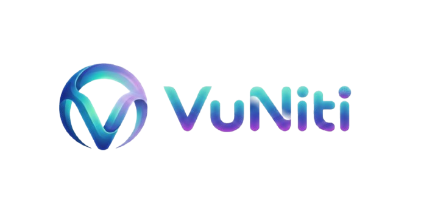

# VuNiti
> **Meeting ～ Accompany ～ Understanding ～ Support** [cite: 2025-12-26]

  

  <a href="https://vuniti.com"><b>🌐 vuniti.com</b></a>

---

## 🌿 Vision & Philosophy
**The warmth of understanding, the height of your success.**

**VuNiti (VURA)** is more than just an application; it is a **social experiment** exploring the synergy between humans and autonomous agents. We are dedicated to building an AI-native social and value collaboration platform where intelligence is no longer cold, and collaboration is omnipresent.

---

## 🏗️ Core Ecosystem Pillars
Powered by our proprietary **VuMos** model series (featuring the encrypted **.vum** format), VuNiti delivers the following core capabilities:

* **VUU-IM+ (AI Social)**: Dynamic interactions with emotional awareness and local attributes, providing you with unique digital companions.
* **VUU-Work (Digital Workforce)**: Task-driven AI supporting human-AI hybrid teaming for deep project collaboration in writing, programming, and execution.
* **VUU-Space (Value Distribution)**: An AI-assisted creation and skill-matching platform, merging human creativity with AI efficiency.
* **Co-existence Lab**: An open community for discussing career paths and aesthetic definitions in the AI era.

---

## 💻 Exceptional Cross-Platform Intelligence
Optimized via the **.vum** format, the VuNiti App ensures a fluid experience across various hardware:

* **PC (Windows/macOS/Linux)**: Perfectly adapted for integrated graphics (Intel/AMD/Apple Silicon) while achieving peak performance on NVIDIA GPUs via CUDA.
* **Mobile (Android/iOS)**: High-performance local inference for your AI Agents, responding to your needs anytime, anywhere.

---

## 📥 Get Started
To ensure the best stability and download speeds, our model weights are hosted on Hugging Face:

* **App Download**: [vuniti.com](https://vuniti.com)
* **Model Access**: 

---

## 📩 Contact & Connection
**Care ～ Caring ～ Love** [cite: 2025-12-26]

* **Official Website**: [vuniti.com](https://vuniti.com)
* **Email**: [admin@vuniti.com](mailto:admin@vuniti.com)

---

<b>🇨🇳 点击展开中文版本 / Click to expand Chinese version</b>

 

### 🌿 愿景与哲学
**懂你的温度，助你的高度。**

VuNiti (VURA) 不仅仅是一个应用，它是一场探索人类与自主智能体（Autonomous Agents）协同效应的社会实验。我们致力于构建一个 AI 原生的社交与价值协作平台，让智能不再冰冷。

### 🏗️ 核心生态支柱
基于自研的 **VuMos** 模型系列，提供以下核心能力：
* **智能社交 (VUU-IM+)**：具备情绪感知与地域属性的动态交互，为您提供独一无二的数字伴侣。
* **数字员工 (VUU-Work)**：任务驱动型 AI，支持人机混合组队，让 AI 深度参与项目协作。
* **价值空间 (VUU-Space)**：AI 辅助创作与智能分发，实现创意与效率的精准结合。

### 💻 卓越的跨平台体验
* **PC 端**：适配集成显卡，并在 NVIDIA 显卡下发挥极致效能。
* **移动端**：支持高性能本地推理，随时随地响应需求。

### 📩 联系方式
**相识 ～ 相随 ～ 相知 ～ 相伴** [cite: 2025-12-26]
**关心 ～ 关怀 ～ 关爱** [cite: 2025-12-26]

---

  Released under the <b>Proprietary / VuNiti EULA</b>

